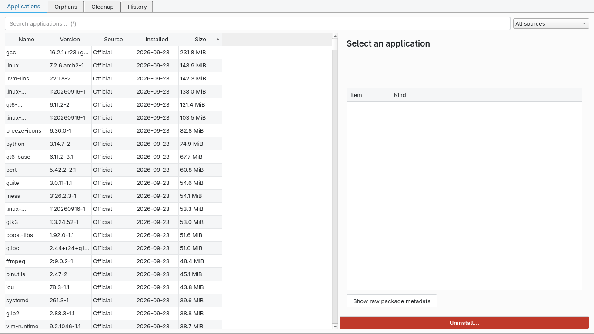
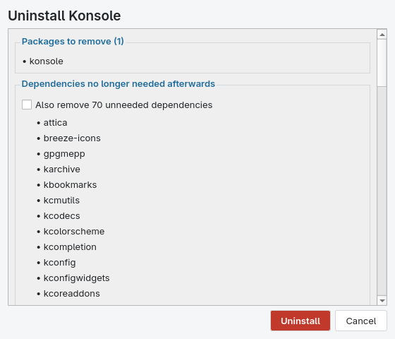

# CachyUninstall

[](https://github.com/ShahabAhmed01/cachyuninstall/actions/workflows/ci.yml)
[](LICENSE)
[](https://github.com/ShahabAhmed01/cachyuninstall/releases/latest)
[](pyproject.toml)

**A native, safe, transparent application uninstaller and leftover-data
analyzer for Arch Linux and CachyOS.**

```text
Find application → understand it → see exactly what removal does
→ confirm → authorize → remove → clean selected leftovers → honest report
```

<p align="center">
  
</p>
<p align="center">
  
</p>

## Why it exists

`pacman -Rns` is fine — but it cannot tell you that an application left
`~/.config/foo`, `~/.cache/foo` and a stray autostart entry behind. Cleanup
tools can find files — but they don't know which package owned what, so they
guess. CachyUninstall combines the actual package database (libalpm) with an
evidence-based leftover scanner and a strict safety model:

* **Never deletes anything owned by an installed package.**
* **Never touches system paths directly** — system changes happen only inside
  libalpm transactions, authorized by polkit.
* **Never infers AUR**: a package not in your configured repositories is
  labelled "foreign", no more (§24 of the design spec).
* **Preview before destructive action, always** — REMOVE / KEEP (shared) /
  USER DATA / PROTECTED, with a reason for every item.
* Config is *kept* by default; low-confidence candidates are hidden by default.

## Not

Not a package store, not a "system cleaner/optimizer/booster", not telemetry,
not Electron. It does one job.

## Features

* Application list from the real local package database (pyalpm) with human
  names from desktop entries; sources: Official / CachyOS / Foreign / Flatpak /
  Manual(AppImage inspection).
* Package details: dependencies, reverse dependencies, optdepends, files,
  backup files, groups, install date, raw metadata.
* Removal planner: explains shared dependencies and *becoming-orphan* deps;
  blocked removals explain exactly by what.
* Leftover scanner: XDG config/cache/data/state, autostart, user desktop
  files, user systemd units — with confidence levels and per-item reasons.
* Quarantine with manifest + restore (user-owned files only).
* Orphan view. History + crash journal (SQLite, local).
* CLI: `--list --orphans --dry-run PKG --leftovers PKG --remove PKG [--yes]
  [--json]`.
* Offline by design. No network in any core flow.

## Install

```bash
pacman -S cachyuninstall            # once it's in the CachyOS repositories
# or from this repository (build outside src/ — see docs/PACKAGING.md):
scripts/mksource.sh
mkdir -p build-aur
cp PKGBUILD cachyuninstall.install cachyuninstall-1.0.0.tar.gz build-aur/
(cd build-aur && makepkg -si)
```

## Usage

Launch `CachyUninstall` from your desktop (or `cachyuninstall`). Select an
application → **Uninstall…** → review the preview → confirm → enter your
password once (polkit) → done. Cleanup selections are yours; protected items
are shown, not silently deleted.

CLI examples:

```bash
cachyuninstall --list | less
cachyuninstall --dry-run firefox
cachyuninstall --leftovers firefox --json
cachyuninstall --orphans
cachyuninstall --remove firefox --also-orphans   # asks; --yes to skip prompt
```

## Safety model (short version)

The GUI runs as your user — never as root, never via `sudo`. The root side is
a D-Bus system service (`org.cachyos.Uninstall`) guarded by polkit action
`org.cachyos.uninstall.remove`, and it can do exactly one thing: run a libalpm
removal transaction for validated package names. There is **no** "delete this
path" verb on the privileged side at all. User-file cleanup happens as your
user, with symlink-safe, descriptor-based deletion and re-verification of
every item immediately before removal. Full model: `docs/SECURITY.md`.

## Limitations (honest ones)

* Leftover detection is conservative by design: data stored under a name
  unrelated to the application is not found instead of guessed.
* `/etc` and `/var` are not scanned; pacman keeps modified configs as
  `.pacsave` files, which the package's backup list reveals.
* Manual/AppImage installations are inspect-only in this release.
* Flatpak support requires `flatpak` installed (optional dependency).

Note: theoretical completeness of leftover detection is impossible on Linux —
package metadata does not track user-created data. CachyUninstall optimizes
for *never deleting the wrong thing*.

## Development / contributing

See `docs/DEVELOPMENT.md` and `CONTRIBUTING.md`. QA gates live in
`scripts/validate-release.sh`.

## Evidence & certification

This release was certified through a physical QA campaign in a disposable
environment: **122 automated tests** (unit, security, property, UI,
read-only integration), physical destructive acceptance (real removals,
stale-plan / lock / polkit-denial paths, filesystem-safety suite), the
packaging cycle (`makepkg` → `pacman -U` → self-uninstall) and a physical
Flatpak dual-scope cycle. The full 25-row certification table with
categories, evidence references and honest known limitations:
[RELEASE_READINESS.md](RELEASE_READINESS.md). Manual QA checklist:
[docs/QA_MANUAL.md](docs/QA_MANUAL.md). Decision record:
[docs/DECISIONS.md](docs/DECISIONS.md).

## License

GPL-3.0-or-later — see `LICENSE`.
